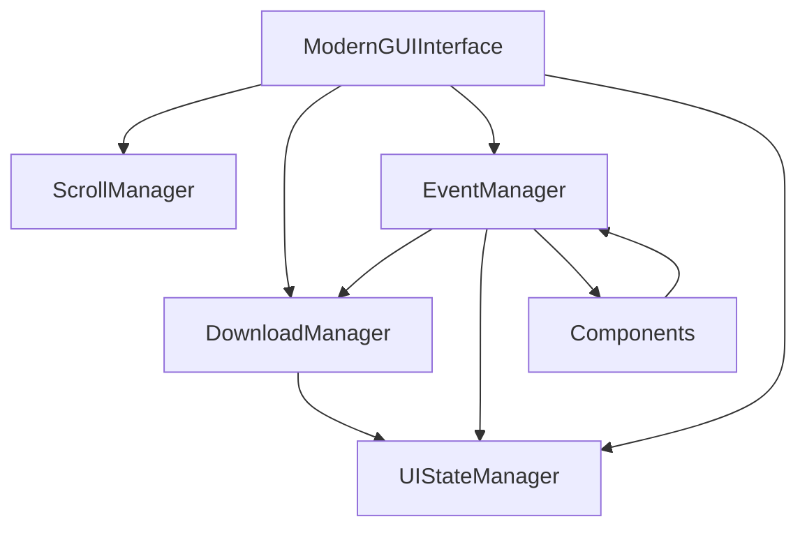

# 🔧 GUI Refactoring Documentation

## 📊 Resumen de la Refactorización

El archivo `gui/interface.py` fue refactorizado de **561 líneas** a **159 líneas** (reducción del 72%) mediante la separación de responsabilidades en managers especializados.

## 🏗️ Nueva Estructura

### Antes (561 líneas)
```
gui/interface.py  # TODO EN UN SOLO ARCHIVO
├── ModernGUIInterface (gigantesca)
├── Manejo de scroll (100+ líneas)
├── Manejo de descargas (150+ líneas)  
├── Manejo de eventos (200+ líneas)
└── Estado de UI (50+ líneas)
```

### Después (159 líneas principales)
```
gui/
├── interface.py (159 líneas) - Clase principal limpia
└── managers/
    ├── __init__.py (14 líneas)
    ├── scroll_manager.py (105 líneas) 
    ├── download_manager.py (186 líneas)
    ├── event_manager.py (180 líneas)
    └── ui_state_manager.py (53 líneas)
```

## 🎯 Managers Creados

### 1. `ScrollManager` (105 líneas)
**Responsabilidad**: Manejo del contenedor scrolleable
- ✅ Creación del canvas y scrollbar
- ✅ Eventos de mouse wheel
- ✅ Redimensionamiento automático
- ✅ Actualización de scroll region

### 2. `DownloadManager` (186 líneas)  
**Responsabilidad**: Lógica de descargas
- ✅ Configuración del downloader
- ✅ Threading para descargas
- ✅ Callbacks de progreso
- ✅ Manejo de subtítulos externos
- ✅ Detección de videos sin subtítulos

### 3. `EventManager` (180 líneas)
**Responsabilidad**: Eventos y callbacks de la GUI
- ✅ Análisis de URLs
- ✅ Cambios en selección de archivos
- ✅ Inicios y cancelaciones de descarga
- ✅ Keyboard shortcuts
- ✅ Validaciones de entrada

### 4. `UIStateManager` (53 líneas)
**Responsabilidad**: Estado y configuración de la UI
- ✅ Creación de ventana principal
- ✅ Centrado de ventana  
- ✅ Estados de descarga
- ✅ Configuración de tema

## 🔄 Flujo de Comunicación



## ✅ Beneficios del Refactoring

### 📏 **Mantenibilidad**
- ✅ Archivos más pequeños y fáciles de leer
- ✅ Responsabilidades claramente separadas
- ✅ Menos acoplamiento entre funcionalidades

### 🔍 **Legibilidad**  
- ✅ Código más organizado por dominio
- ✅ Nombres descriptivos de managers
- ✅ Lógica agrupada por función

### 🛠️ **Extensibilidad**
- ✅ Fácil agregar nuevos managers
- ✅ Modificar funcionalidades específicas
- ✅ Testing individual de componentes

### 🐛 **Debugging**
- ✅ Errores más fáciles de localizar
- ✅ Stack traces más claros
- ✅ Isolación de problemas

## 📋 Líneas de Código por Archivo

| Archivo | Líneas | Responsabilidad |
|---------|--------|----------------|
| `interface.py` | 159 | Coordinación principal |
| `download_manager.py` | 186 | Lógica de descarga |
| `event_manager.py` | 180 | Manejo de eventos |
| `scroll_manager.py` | 105 | Container scrolleable |
| `ui_state_manager.py` | 53 | Estado de UI |
| `managers/__init__.py` | 14 | Exports |

**Total**: 697 líneas (vs 561 original + mejor organización)

## 🚀 Uso

```python
# La interfaz principal sigue siendo la misma
from gui import GUIInterface

app = GUIInterface()
app.run()
```

## 🔮 Futuras Mejoras

Con esta estructura modular, es más fácil:

1. **Agregar nuevos managers**:
   - `ThemeManager` - Para manejo de temas
   - `ConfigManager` - Para persistir configuraciones
   - `UpdateManager` - Para actualizaciones automáticas

2. **Testing individual**:
   - Unit tests para cada manager
   - Mocks más simples
   - Testing isolado

3. **Extensiones**:
   - Plugins system
   - Custom downloaders
   - Advanced UI features 